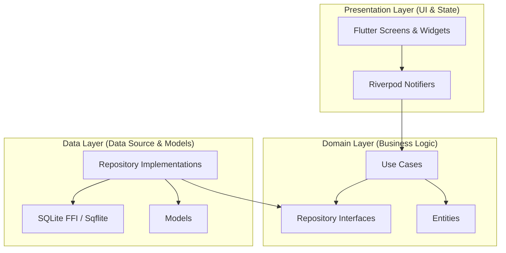

# MicroBill

A premium, 100% offline, commercial-grade billing and invoicing application built with Flutter.

---

## Architecture Overview
MicroBill is engineered using **Clean Architecture** principles to separate core business logic from outer infrastructure layers (UI, SQLite database, PDF generator). This guarantees modularity, testability, and long-term maintainability.



## Features
* **100% Local Storage**: Secured using a relational SQLite database. Works offline with zero cloud APIs.
* **Responsive Layout**: Fluid UI layout that automatically adapts to Mobile, Tablet, and Desktop (Windows, Linux, macOS).
* **Client Directory**: Manage billing addresses, contact details, and VAT/Tax registration records.
* **Product Inventory**: Track price rates, SKUs, tax brackets, units of measure, and warning levels for stock.
* **Invoice Builder**: Calculations engine for line items, discounts (flat/percentage), local taxes, and balance tracking.
* **PDF Exporter & Printing**: Built-in visual PDF generator configured for clean A4 printing, email sharing, or local file saving.

## Tech Stack
* **Framework**: Flutter (Latest Stable channel)
* **State Management**: Riverpod (`flutter_riverpod` + Notifiers)
* **Navigation**: GoRouter
* **Dependency Injection**: GetIt
* **Local Database**: SQLite (`sqflite` for Android, `sqflite_common_ffi` for Desktop)
* **Doc Generation**: `pdf` & `printing`

## Getting Started

### Prerequisites
* Flutter SDK (3.22+ recommended)
* Android Studio / Xcode (for mobile emulators)
* Visual Studio / Desktop build tools (for Windows native builds)

### Enable Windows Developer Mode
To build and run the Windows desktop application, you must enable **Developer Mode** on your system to allow Flutter to create the required symlinks for desktop plugins:
1. Open Windows Settings.
2. Navigate to **System > For developers** (or run `explorer ms-settings:developers` in terminal).
3. Toggle **Developer Mode** to **On**.

### Running the App
1. Clone this repository to your workspace.
2. Install dependencies:
   ```bash
   flutter pub get
   ```
3. Run the application:
   ```bash
   flutter run
   ```

### Running Tests
Execute unit and widget tests:
```bash
flutter test
```
